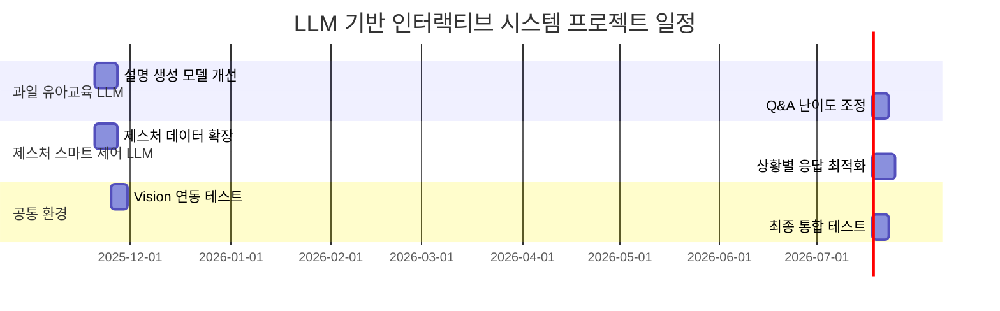

# LLM 기반 인터랙티브 교육·제어 시스템 프로젝트

## 1. 프로젝트 개요 *필수작성*

* **수행 학기:** 2학기
* **프로젝트명:** LLM 기반 인터랙티브 교육·제어 시스템 개발
* **작성날짜:** 2025.11.17

| 구분 | 성명  | 학번       | 소속학과      | 깃허브 아이디      |
| -- | --- | -------- | --------- | ------------ |
| 1  | 김건우 | 20201702 | 컴퓨터학과     | rjsdn2308    |
| 2  | 강민수 | 20231901 | 데이터사이언스학과 | MoriartyKang |
| 3  | 이준성 | 20211704 | 데이터사이언스학과 | junsung2001  |

* **지도교수:** 화성의과학대학교 김정은 교수

---

## 2. 프로젝트 내용

### 2.1 서론

현대의 인공지능 기술은 교육, IoT, 콘텐츠 생성 등 다양한 분야에서 활용되고 있다. 본 프로젝트는 특히 **LLM(Large Language Model)**의 강점을 살려 **유아 교육**과 **스마트 홈 제어**라는 두 가지 실제 도메인 문제를 해결하는 것을 목표로 한다.

1. **유아 교육 분야**: 어린아이들이 과일 정보를 쉽고 재미있게 배울 수 있도록 하는 학습형 LLM 개발.
2. **IoT·스마트 홈 분야**: 손 제스처와 사용자 명령어를 LLM이 자연어로 해석하여 친숙한 안내문으로 변환하는 시스템 개발.

본 프로젝트는 두 도메인에 LLM을 적용해 "사용자 친화적 인공지능 시스템" 가능성을 확인하며, Vision, IoT, RAG 기반 서비스로 확장 가능한 기반 구축을 목표로 한다.

---

### 2.2 추진 배경

#### 2.2.1 개발 배경 및 필요성

📌 **과일 유아교육 LLM**

* 유아·초등학생 맞춤 설명자료 부족
* 교재 기반 설명은 딱딱하거나 흥미 요소 부족
* AI 기반 맞춤형 교육 콘텐츠 필요 증가

📌 **손 제스처 제어 LLM**

* 스마트홈 기기 증가, 제어 방식은 버튼/음성 중심
* 직관적 “제스처 + 대화형 안내” 시스템 필요
* IoT와 LLM 결합 시 사용자 편의성 증가

#### 2.2.2 선행기술 및 사례 분석

| 분야    | 기술/서비스       | 특징            | 한계                  |
| ----- | ------------ | ------------- | ------------------- |
| 유아 교육 | 키즈 학습앱       | 그림·음성을 활용한 교육 | 사용자와의 대화적 상호작용 부족   |
| 스마트홈  | 스마트싱스, 홈 IoT | 음성 명령 지원      | 자연스러운 피드백·상황설명 부족   |
| LLM   | ChatGPT 등    | 유연한 대화형 응답    | 도메인 제약 없이 일반적 설명 위주 |

📌 두 분야 모두 **사용자 맞춤 대화형 피드백** 부족, LLM 활용 가능성 높음.

#### 2.2.3 기술적 동향 분석

* GPT-4o-mini 등 경량 고품질 모델 등장
* IoT + LLM 융합 서비스 증가
* RAG 및 Multimodal 증가 → Vision 기반 서비스 확장 용이

#### 2.2.4 기술적 문제점

* 기존 교육 콘텐츠는 사용자 수준 충분히 반영하지 못함
* 스마트홈 안내 메시지가 기계적
* 맞춤형 언어생성 어려움 → LLM 적용 필요

#### 2.2.5 본 프로젝트의 차별점

* 아이 연령대 맞춤 설명 자동 생성
* 제스처 + 명령 조합한 자연스러운 피드백 생성
* LLM 기반 사용자 중심 인터랙션 구조
* 공통 환경 (.env) 활용 재사용성 높은 구조 설계
* Vision + RAG 기반 확장 가능

---

### 2.3 목표 및 내용

#### 2.3.1 프로젝트 목표

1. 과일 유아 맞춤형 설명 생성 시스템 개발
2. 아이 질문에 친근하게 답변하는 Q&A LLM 구축
3. 손 제스처 + 명령 기반 스마트 제어 안내 LLM 개발
4. 자연스러운 언어 피드백 자동생성 프롬프트 엔지니어링
5. 공통 실행환경(.env) 기반 안정적 개발 구조 구축
6. 전체 시스템 데모 실행 가능 수준 MVP 완성

#### 2.3.2 개발 내용

### 📌 (1) 과일 유아교육 LLM

* 파일: `fruit_tutor.py`, `fruit_qa.py`
* 기능: 과일 이름과 연령대 입력 → 유아용 설명 생성
* 특징: 성장 과정, 영양소, 재배 환경 포함, 연령별 말투 조절, 자연스러운 Q&A 대응

#### TensorFlow 이미지 분류 모델 분석

1. **기본 설정 & 디렉토리 생성**

* 입력 이미지 크기: 224×224, 배치 크기: 32
* 데이터셋 경로: `dataset/`, 학습 모델 저장 디렉토리 생성

2. **데이터셋 불러오기**

* `train_ds`, `val_ds`로 불러오고 20% 검증용 사용
* 폴더 구조: 클래스별 폴더 (apple, banana, orange 등)

3. **prefetch() 적용**

* CPU에서 미리 다음 배치 준비 → GPU와 병렬 처리
* 학습 속도 증가

4. **데이터 증강**

* 좌우 반전, 회전 ±10%, 확대/축소 ±20%, 대비 변화
* 모델 일반화 성능 향상

5. **EfficientNetV2S 전이학습**

* ImageNet pretrained 백본, include_top=False
* feature extractor 동결, GAP, Dropout, Dense Softmax 출력

6. **모델 컴파일**

* Optimizer: Adam
* Loss: sparse_categorical_crossentropy
* Metrics: accuracy

7. **콜백 설정**

* EarlyStopping: val_loss 5 epoch 개선 없으면 중단, 최고 가중치 복원
* ModelCheckpoint: val_loss 기준 최고 모델만 저장

8. **모델 학습**

* 최대 10 epoch, EarlyStopping 적용
* 학습 과정 history에 저장

9. **TensorFlow Lite 변환**

* TFLiteConverter로 모바일/임베디드 사용 가능
* Optimize.DEFAULT 적용 → 양자화, 모델 크기 감소 & 속도 증가

#### 장점 및 단점

* 장점: pretrained EfficientNet 사용, 데이터 증강 통한 일반화, TFLite 변환으로 경량화
* 단점: 작은 데이터셋에서는 오버피팅 가능, GPU 필요

### 📌 (2) 제스처 기반 스마트 제어 LLM

* 파일: `gesture_control_demo.py`
* 기능: 제스처(open_palm, fist 등) + 사용자 명령어 입력 → LLM이 1~2문장으로 자연스러운 안내 메시지 생성
* 특징: 한국어/영어 지원, 스마트홈 및 IoT 시스템 확장 가능
* 데이터셋: [HaGRID Gesture Dataset](https://www.kaggle.com/datasets/kapitanov/hagrid)

### 📌 (3) 공통 실행 환경

* 파일: `.env`, `실행방법.txt`
* 기능: OPENAI_API_KEY, HUGGINGFACE_TOKEN 관리, 전체 프로젝트 공통 구조
* 실행방법.txt 통해 전체 프로젝트 실행 방법 제공

---

### 2.3.4 개발 환경

* Python 3.10+
* OpenAI SDK
* dotenv 기반 API 로딩
* (선택) Vision 모델 연동 가능 (fruit-vision-app.zip)

---

### 2.3.5 결과

* 과일 설명 및 Q&A LLM 정상 동작
* 제스처 + 명령 기반 피드백 생성 LLM 동작
* 공통 API Key 환경 적용
* 전체 실행 가능 상태의 MVP 구축 완료

---

## 2.4 기대효과

### 교육적 효과

* 아이 연령대에 맞춘 자연스러운 맞춤형 교육 제공
* 재미있는 과일 설명 통한 흥미 유발

### 기술적/사회적 효과

* 제스처 기반 제어의 직관성 증가
* LLM 기반 스마트홈 기술 확장 가능성 확보
* IoT·교육 분야에서 LLM 적용 가능성 확인

---

## 2.5 향후 계획

---

## 2.6 역할 분담

|  구분 |  성명 | 팀내 역할                  |
| :-: | :-: | ---------------------- |
|  1  | 김건우 | LLM 시스템 개발, 프롬프트 엔지니어링 |
|  2  | 강민수 | 데이터 구조 설계, 기능 테스트      |
|  3  | 이준성 | API 환경 설정, 모델 성능 점검    |

---

## 2.7 참고문헌

1. OpenAI, GPT 모델 기술 문서, 2024.
2. HaGRID Gesture Dataset Documentation.
3. LLM 기반 교육용 콘텐츠 사례 분석, 2023.
4. 업로드 파일: fruit_tutor.py, gesture_control_demo.py, .env, 실행방법.txt.
