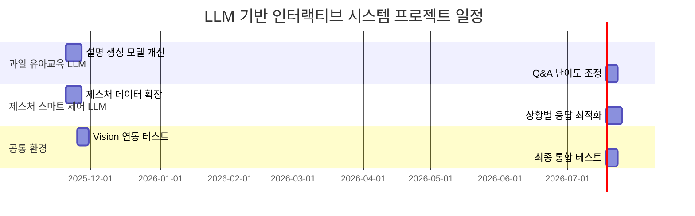

# 🌟 프로젝트 중간보고서 (통합 LLM 프로젝트)

> 요청한 **프로젝트 중간보고서 공식 양식 형식**에 맞추어
> **과일 유아교육 LLM + 제스처 기반 스마트 제어 LLM + 공통 실행환경**
> 3개 프로젝트로 재작성한 최종 보고서입니다.

---

## 1. 프로젝트 개요 *필수작성*

* **수행 학기:** 2학기
* **프로젝트명:** LLM 기반 인터랙티브 교육·제어 시스템 개발
* **작성날짜:** 2025.11.17

| 구분 | 성명  | 학번       | 소속학과      | 깃허브 아이디      |
| -- | --- | -------- | --------- | ------------ |
| 1  | 김건우 | 20201702 | 컴퓨터학과     | rjsdn2308    |
| 2  | 강민수 | 20231901 | 데이터사이언스학과 | MoriartyKang |
| 3  | 이준성 | 20211704 | 데이터사이언스학과 | junsung2001  |

* **지도교수:** 화성의과학대학교 김정은 교수

---

## 2. 프로젝트 내용

### 2.1 서론

현대의 인공지능 기술은 교육, IoT, 콘텐츠 생성 등 다양한 분야에서 활용되고 있다. 본 프로젝트는 특히 **LLM(Large Language Model)**의 강점을 살려 **유아 교육**과 **스마트 홈 제어**라는 두 가지 실제 도메인 문제를 해결하는 것을 목표로 한다.

1. **유아 교육 분야**에서는 어린아이들이 과일 정보를 쉽고 재미있게 배울 수 있도록 하는 학습형 LLM을 개발한다. 아이 연령대에 맞춘 쉬운 문장, 이모지, 재미 요소 등을 활용해 이해도를 높이고자 한다.

2. **IoT·스마트 홈 분야**에서는 손 제스처와 사용자 명령어를 LLM이 자연어로 해석하여 사용자에게 친숙한 안내문으로 변환하는 시스템을 개발한다.

본 프로젝트는 두 도메인에 LLM을 적용해 "사용자 친화적 인공지능 시스템"의 가능성을 확인하며, 이를 통해 앞으로 Vision, IoT, RAG 기반 서비스로 확장 가능한 기반을 구축하는 데 목적이 있다.

---

### 2.2 추진 배경 (자료조사 및 요구분석)

#### 2.2.1 개발 배경 및 필요성 *필수작성*

📌 **과일 유아교육 LLM**

* 유아·초등학생에게 맞는 전문적인 설명자료가 부족함
* 교재 기반 설명은 딱딱하거나 흥미 요소가 부족함
* AI 기반 맞춤형 교육 콘텐츠 필요성 증가

📌 **손 제스처 제어 LLM**

* 스마트홈 기기가 증가하지만 제어 방식은 아직 버튼/음성 중심
* 직관적이고 자연스러운 “제스처 + 대화형 안내” 시스템 수요 증가
* IoT와 LLM 결합 시 높은 사용자 편의성 제공 가능

#### 2.2.2 선행기술 및 사례 분석 *필수작성*

| 분야    | 기술/서비스       | 특징            | 한계                  |
| ----- | ------------ | ------------- | ------------------- |
| 유아 교육 | 키즈 학습앱       | 그림·음성을 활용한 교육 | 사용자와의 대화적 상호작용 부족   |
| 스마트홈  | 스마트싱스, 홈 IoT | 음성 명령 지원      | 자연스러운 피드백·상황설명 부족   |
| LLM   | ChatGPT 등    | 유연한 대화형 응답    | 도메인 제약 없이 일반적 설명 위주 |

📌 즉, 두 분야 모두 **“사용자 맞춤 대화형 피드백”**이 부족한 상황이며 LLM 활용 가능성이 큼.

#### 2.2.3 기술적 동향 분석

* GPT-4o-mini 등 경량 고품질 모델의 등장
* IoT + LLM 융합 서비스 증가
* RAG 및 Multimodal 증가 → Vision 기반 서비스 확장 용이

#### 2.2.4 기술적 문제점(선행기술의 한계)

* 기존 교육 콘텐츠는 개별 사용자 수준을 충분히 반영하지 못함
* 스마트홈 제어에서 안내 메시지가 기계적임
* 사용자 친화적 맞춤형 언어생성이 어려움 → LLM 적용 필요

#### 2.2.5 본 프로젝트의 차별점

ⓐ 아이 연령대 맞춤 설명 자동 생성
ⓑ 제스처와 명령 조합한 자연스러운 피드백 생성
ⓒ LLM 기반 사용자 중심 인터랙션 구조
ⓓ 공통 환경 (.env) 활용한 재사용성 높은 구조 설계
ⓔ 향후 Vision + RAG 기반 확장 가능

---

### 2.3 목표 및 내용

#### 2.3.1 프로젝트 목표 *필수작성*

1. 과일 정보에 대한 유아 맞춤형 설명 생성 시스템 개발
2. 아이 질문에 친근하게 답변하는 Q&A LLM 구축
3. 손 제스처 + 명령 기반 스마트 제어 안내 LLM 개발
4. 자연스러운 언어 피드백을 자동생성하는 프롬프트 엔지니어링
5. 공통 실행환경(.env) 기반 안정적 개발 구조 구축
6. 전체 시스템 데모 실행 가능 수준의 MVP 완성

#### 2.3.2 개발 내용 *필수작성*

### 📌 (1) 과일 유아교육 LLM

파일: `fruit_tutor.py`, `fruit_qa.py`
출처: fileciteturn0file0

* 과일 이름 + 연령대 입력 → 유아용 설명 생성
* 성장 과정, 영양소, 재배 환경 포함
* 유치원/초등 저학년 등 연령별 말투 조절
* 아이 질문에 대한 자연스러운 Q&A 대응

### 📌 (2) 제스처 기반 스마트 제어 LLM

파일: `gesture_control_demo.py`
출처: fileciteturn0file1

* 제스처(open_palm, fist 등) + 사용자 명령어 입력
* LLM이 1~2문장으로 자연스러운 안내 메시지 생성
* 한국어/영어 지원
* 스마트홈, IoT 시스템으로 확장 가능

### 📌 (3) 공통 실행 환경

파일: `.env`, `실행방법.txt`
출처: fileciteturn0file2 fileciteturn0file5

* OPENAI_API_KEY, HUGGINGFACE_TOKEN 관리
* 모든 LLM 프로젝트 공통 구조로 활용
* 실행방법.txt 통해 전체 프로젝트 실행 방법 제공

---

### 2.3.4 개발 환경

* **Python 3.10+**
* **OpenAI SDK**
* **dotenv 기반 API 로딩**
* (선택) Vision 모델 연동 가능 (fruit-vision-app.zip)

---

### 2.3.5 결과 *필수작성*

현재까지 진행된 내용:

* 과일 설명 및 Q&A LLM 정상 동작
* 제스처 + 명령 기반 피드백 생성 LLM 동작
* 공통 API Key 환경 적용
* 전체 실행 가능 상태의 MVP 구축 완료

---

## 2.4 기대효과

### ● 교육적 효과

* 아이 연령대에 맞춘 자연스러운 맞춤형 교육 제공
* 재미있는 과일 설명을 통한 흥미 유발

### ● 기술적/사회적 효과

* 제스처 기반 제어의 사용자 직관성 증가
* LLM 기반 스마트홈 기술 확장 가능성 확보
* IoT·교육 분야에서의 LLM 적용 가능성 확인

---

## 2.5 향후 계획 (프로젝트 일정) *필수작성*

---

## 2.6 역할 분담

|  구분 |  성명 | 팀내 역할                  |
| :-: | :-: | ---------------------- |
|  1  | 김건우 | LLM 시스템 개발, 프롬프트 엔지니어링 |
|  2  | 강민수 | 데이터 구조 설계, 기능 테스트      |
|  3  | 이준성 | API 환경 설정, 모델 성능 점검    |

---

## 2.7 참고문헌

1. OpenAI, GPT 모델 기술 문서, 2024.
2. HaGRID Gesture Dataset Documentation.
3. LLM 기반 교육용 콘텐츠 사례 분석, 2023.
4. 업로드 파일: fruit_tutor.py, gesture_control_demo.py, .env, 실행방법.txt.

---

필요하면 **PDF / PPT 변환**, **발표용 슬라이드**, **세부 설계도(시퀀스 다이어그램, 아키텍처)**도 만들어줄게!
